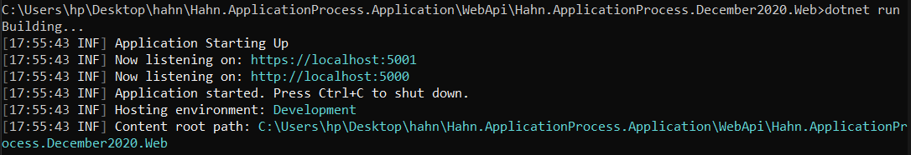

# How to start the application

After unzipping the project

## Step 1 - How to start the API

- Change directories using the command prompt to run the API.

   ```cmd
       cd Hahn.ApplicationProcess.Application\WebApi>
   ```

- After that, do a dotnet restore the output of that command is shown below.


```cmd
cd Hahn.ApplicationProcess.December2020.Web
```

- After the change you will be right here 🎉

   ```cmd
        Han.December2020\WebApi\Hahn.ApplicationProcess.December2020.Web>
   ```

- Do a dotnet run the output should be the result shown below.



## Step 2 - How to start the FRONTEND/UI

- Open a new terminal and change directory to Aurelia/applicant-ui

```cmd
   Hahn.ApplicationProcess.Application\Aurelia\applicant-ui
```

- Do an npm install to install all the necessary dependencies

- After the installation type npm start to start the application

- Navigate to the url http://localhost:8080/ on your favorite browser

- You will be greeted by the page below for adding an applicant.


- After a successful registration an applicant is redirected to the confirmation page below


## Extra features

- A dashboard for updating applicants and also deleting applicants

- The dashboard is also paginated 6 records per-page


